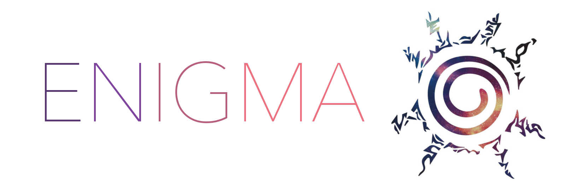

Enigma
======
[](https://goreportcard.com/report/github.com/shashankgroovy/enigma)
[](https://github.com/shashankgroovy/enigma/blob/master/LICENSE)


A small service written in Go and Vue.js which lets you share self-destructing
secrets.

Secret messages will self-destruct/expire after it has been viewed a given
number of times or if the time expires.

# [Live Demo](https://blooming-hollows-63159.herokuapp.com/)

See it live!

Requirements
------------
* Go version v1.12
* MongoDB version v3.6
* Vue.js version v2.6


Getting Started
---------------

Run Enima backend server by issuing the following commands:

```
λ go build -o bin/enigma -v
λ ./bin/enigma
```
And the server will be up and running on the specified port.

> Note:
> To load environment variables if you're a terminal girl/guy, you might want
> to use [direnv](https://direnv.net/). Simply, make the variables present in
> `.env.example` available.

### Development

During development Hot-reloading is quite helpful.
[Fresh](https://github.com/gravityblast/fresh) can be used for hot-reloading go
code. And to run simply do the following to make the server go live:

```
λ cp .runner.conf.example runner.conf
λ fresh
```
## Architecture

* The backend is written in Go with [Gorilla/mux](http://www.gorillatoolkit.org/pkg/mux)
  which releases a RESTful api.
* [MongoDB](https://github.com/mongodb/mongo-go-driver) is being used as the
  NoSQL database of choice.
* The frontend uses [Vue.js](https://vuejs.org/) that interacts with the rest
  api.
* All CURD operations are possible via the RESTful api and can respond in XML,
  JSON and can be extended to support YAML.

## Credits
The logo is a reference to the [Eight Trigrams Sealing Jutsu](https://naruto.fandom.com/wiki/Eight_Trigrams_Sealing_Style)
in the anime © Naruto.

## Contribution
Well this is kind of a learning project, feel free to fork it and happy hacking :)

## License
[MIT License](http://mit-license.org/)

Copyright © 2019 Shashank Srivastav

